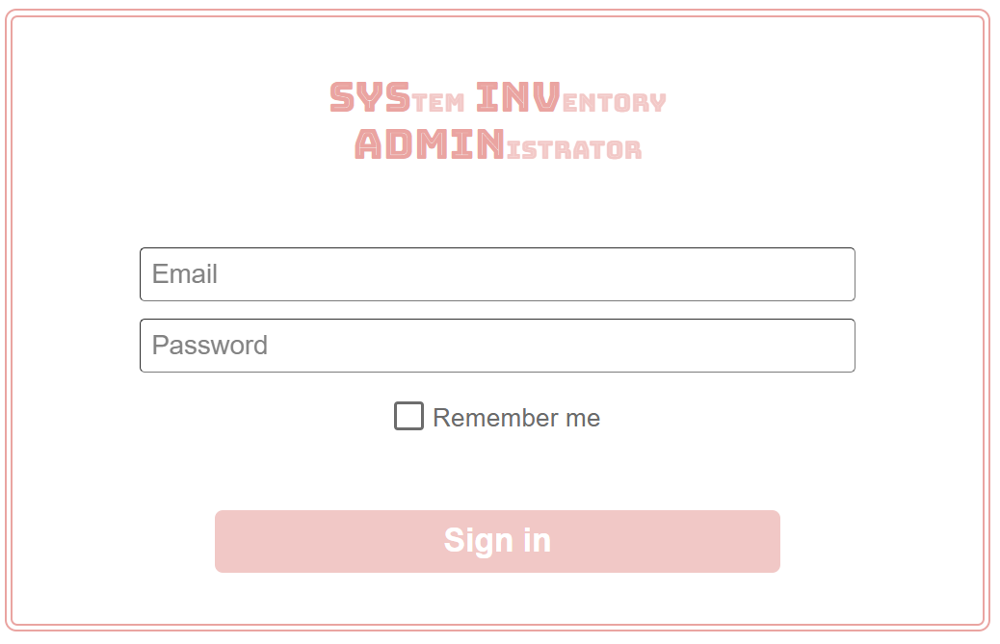

# About SysInvAdmin
SysInvAdmin (System Inventory Administrator) is a custom CMS that provides a headless backend for websites. It is specifically suited for sites that are structured as a sort of inventory. For example: a portfolio site might be considered an inventory of previous projects; a company site might be an inventory of products, a gaming site might be an inventory of different webgames or articles about games.

The backend is built in Laravel, with a UI to access it made with blade components and custom css. Items are added and categorized in this backend. These items are then fetched by querying an API, which lists them in JSON-format. This API response is what you use as a basis for your website: it is the content onto which you build your own presentation layer (the website frontend).

__Why create this when there are already so many similar products?__
In 1 word: style. SysInvAdmin is a stylish CMS, not consisting of bland grey-on-grey menu's, but smooth pink-on-white. Making it custom with my specific use-cases in mind, also means it is less bloated.

## Examples of sites using SysInvAdmin
### Planetegem

My own site, https://planetegem.be, runs on SysInvAdmin (in fact, this is why I started building it). The backend lives at https://inventory.planetegem.be. The site is uses the following calls:
- GET api/categories/index is used to create a menu where you can filter on category
- GET api/items/all (with optional query parameters to filter) is then used to make the homepage (a simple list of all my projects)
- GET api/categories/slug is used to make SEO friendly pages for each category
- GET api/items/slug is used to make a page dedicated to a single 'master' item with all of its 'updates' included. Planetegem only uses the master/update relationship between items.

The items shown on the website then link to custom pages / projects / webgames.

## Setup
### Artisan Commands To Get You Started
1) Run 'php artisan migrate' to create database. I chose an SQlite db, because I was not expecting a lot of concurrent write operations, but you're free to select any type of database you want. Laravel should handle the difference in setup.
2) Run 'php artisan db:seed' to create some defaults. At the moment, these are just languages, which can't be created any other way.
3) Run 'php artisan make:admin {mail} {password}' to create the first admin user, which you can use as login. Once inside, you can use the interface to invite additional users/admins.
4) [TO DO: explain how invitations work]

### Frontend starter kit
I'm working on including a simple starter kit to build a php frontend that easily integrates with SysInvAdmin. It will take care of routing, API calls, and php templates. For a WIP, take a look at the [github page for planetegem.be](https://github.com/planetegem/planetegem-homepage).

### Working with the API
When SysInvAdmin is installed, it automatically comes with OpenAPI / Swagger documentation. For an example, take a look at https://inventory.planetegem.be/api/documentation.

## Features
### Current features

### Roadmap

