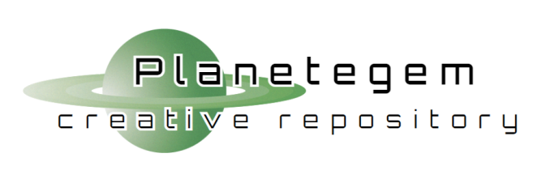

# About SysInvAdmin
SysInvAdmin (System Inventory Administrator) is a custom CMS that provides a headless backend for websites. It is specifically suited for sites that are structured as a sort of inventory. For example: a portfolio site might be considered an inventory of previous projects; a company site might be an inventory of products, a gaming site might be an inventory of different webgames or articles about games.

The backend is built in Laravel, with a UI to access it made with blade components and custom css. Items are added and categorized in this backend. These items are then fetched by querying an API, which lists them in JSON-format. This API response is what you use as a basis for your website: it is the content onto which you build your own presentation layer (the website frontend).

## Examples of sites using SysInvAdmin
### Planetegem

My own site, https://planetegem.be, runs on SysInvAdmin (in fact, this is why I started building it). The backend living at https://inventory.planetegem.be. 

## Setup
### Artisan Commands To Get You Started
1) Run 'php artisan migrate' to create database. I chose an SQlite db, because I was not expecting a lot of concurrent write operations, but you're free to select any type of database you want. Laravel should handle the difference in setup.
2) Run 'php artisan db:seed' to create some defaults. At the moment, these are just languages, which can't be created any other way.
3) Run 'php artisan make:admin {mail} {password}' to create the first admin user, which you can use as login. Once inside, you can use the interface to invite additional users/admins.
4) [TO DO: explain how invitations work]

### Frontend starter kit

## Working with the API

## Features

## Roadmap

